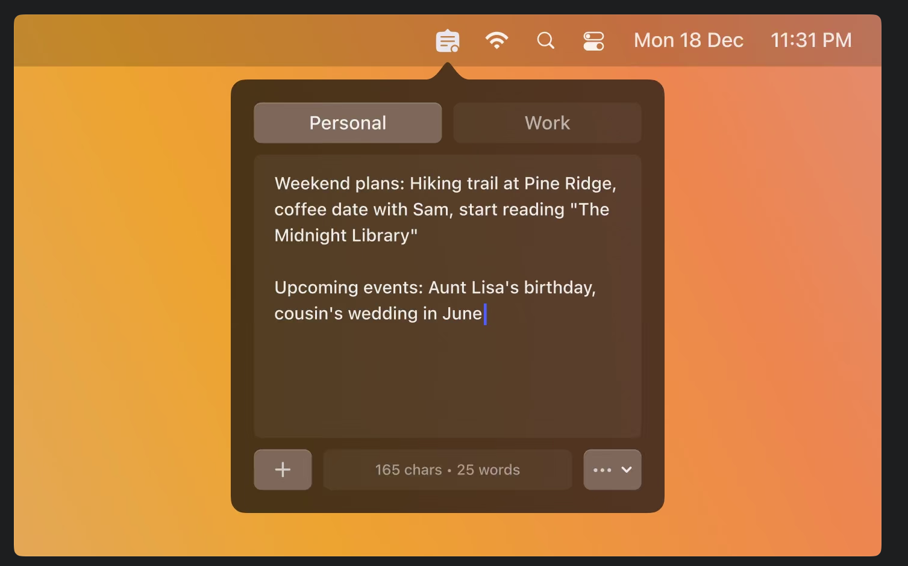
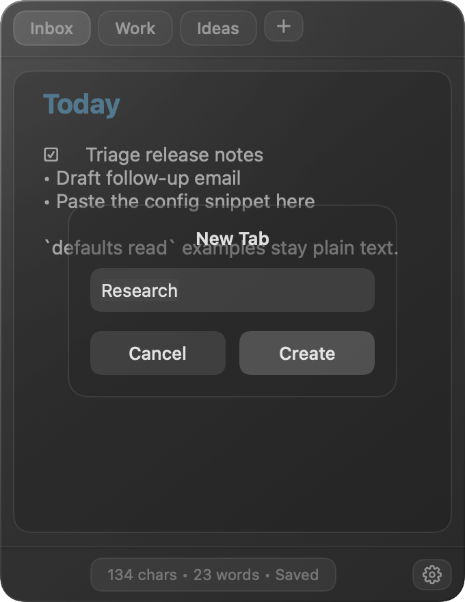

# Notebloat

Notebloat is a small macOS menu bar application for fast, local notes.

It gives you named tabs and one plain text editor per tab. Click the notepad icon in the menu bar, type, and close the popover when you are done. Notes save automatically to a local JSON file.



## Why this exists

Many note applications are larger than the job requires. Notebloat is for temporary notes, quick lists, copied snippets, meeting fragments, and anything else that should be one click away without opening a full notes application.

The design goal is simple:

1. Open instantly from the menu bar.
2. Let the user type immediately.
3. Save locally without a manual save button.
4. Stay small enough to feel like a scratchpad, not a workspace.

## Features

- macOS menu bar application with no Dock icon.
- Named tabs across the top of the popover. Tabs wrap onto additional rows when there are too many to fit.
- One free-form text editor per tab.
- Automatic local saving while typing.
- Save status indicator in the bottom bar.
- Character and word counter in the bottom bar.
- Pinned mode so the popover can stay open while you use other windows.
- Light, dark, and system theme settings.
- Small, medium, and large editor font settings.
- Small, medium, and large popover size settings.
- Optional Markdown live preview with colored headings, rendered list markers,
  task checkboxes, and raw source on the selected line.
- Create tabs from the top-right plus button next to the tab strip.
- Rename tabs by double-clicking a tab or using the tab context menu.
- Drag tabs to reorder them.
- Create, rename, delete, and switch tabs from the user interface.
- Duplicate tab names are made unique automatically.
- Delete confirmation before a tab is removed.
- Import JSON backups and export all tabs as JSON or Markdown.
- Reveal notes in Finder from Settings.
- Daily local backups with retention for the latest 30 backup files.
- Corrupt JSON recovery.
- Launch-at-login setting for signed installed builds.

## Screenshots

### Main popover


### New tab dialog



## Requirements

- macOS 14 Sonoma or newer.
- Swift 5.9 or newer.
- Xcode Command Line Tools are enough for local development.

## Build and run

From the repository root:

```sh
./build.sh
open build/Notebloat.app
```

`build.sh` compiles the Swift sources directly with `swiftc`. It then assembles a proper `Notebloat.app` bundle. The bundle `Info.plist` sets `LSUIElement=true`, so the application runs as a menu bar accessory without a Dock icon.

Do not use `swift build` in this development environment. Swift Package Manager fails during the manifest compile step on the current machine. `Package.swift` is kept for editor support and project structure.

To quit the application, press **Command-Q**.

## Test

Run the model tests:

```sh
./scripts/test-models.sh
```

Run a build smoke test:

```sh
./scripts/smoke-test.sh
```

Create a release zip:

```sh
./scripts/package-release.sh
```

The smoke test verifies that the application bundle is assembled and that `LSUIElement` is enabled.

## Data storage

Notebloat stores notes locally. It does not sync notes to any service.

Main notes file:

```text
~/Library/Application Support/Notebloat/tabs.json
```

Daily backups:

```text
~/Library/Application Support/Notebloat/Backups/
```

If the main JSON file cannot be decoded, Notebloat moves it to a recovery file and starts with a fresh notes file.

Recovery file name pattern:

```text
tabs.corrupt-YYYY-MM-DD-HHMMSS.json
```

The notes file is plain JSON. Deleting it resets the application notes. Settings includes a **Reveal in Finder** button for the notes file.

## Privacy

Notebloat is local-first.

- Notes are stored on your Mac.
- Notes are not sent to a server by this application.
- There is no account system.
- There is no analytics system.
- Local notes are not encrypted by Notebloat. Use FileVault if you need disk-level encryption.

## Keyboard shortcuts

| Shortcut | Action |
| --- | --- |
| Command-N | Create a new tab |
| Command-comma | Open settings |
| Command-Q | Quit Notebloat |
| Escape | Cancel dialogs that use the standard cancel action |

## Project layout

```text
Sources/Notebloat/
  NotebloatApp.swift        Application entry point, status item, and popover control
  Models/
    AppSettings.swift       Theme, font size, popover size enums, and settings keys
    Note.swift              TabItem: one tab with name and text content
    NoteStore.swift         TabStore: tabs, selection, save status, JSON persistence, import, export
  Views/
    BottomBar.swift         The bottom bar with counter, save status, and Settings button
    ContentView.swift       Main popover layout and overlays
    EditorPane.swift        Active-tab editor configuration
    MarkdownTextEditor.swift AppKit plain-text editor with Markdown live preview
    NameDialog.swift        Create, rename, and delete confirmation cards
    SettingsView.swift      Settings panel
    TabBarView.swift        Top tab strip and overflow menu
  Utilities/
    DateFormatting.swift    TextStats character and word counter
    MarkdownStyler.swift    Non-destructive Markdown display attributes
Tests/
  NotebloatModelTests.swift Lightweight model tests compiled by scripts/test-models.sh
scripts/
  package-release.sh        Builds the application and creates build/Notebloat.zip
  smoke-test.sh             Builds the application and verifies the bundle shape
  test-models.sh            Compiles and runs model tests without Swift Package Manager
```

## Implementation notes

Notebloat uses AppKit for the menu bar item and popover lifecycle. The popover content itself is SwiftUI.

This split is intentional. SwiftUI `MenuBarExtra` was less reliable in this local build setup when launched as an accessory application. `NSStatusItem` opens a custom borderless `NSPanel` that hosts SwiftUI. The custom panel gives direct control over positioning, hiding, pinning, and cleanup behavior.

Persistence is handled by `TabStore`. The store keeps the active tab, the tab list, and all tab content. It writes a versioned JSON file to Application Support. Text edits are saved with a short debounce so normal typing does not write the full file on every keystroke.

## Known limitations

- The local build uses ad-hoc signing.
- Launch at login works reliably for signed installed builds. macOS may reject it for local ad-hoc builds.
- There is no cloud sync.
- There is no rich text support.
- A distributable release should use Developer ID signing and notarization.

## Roadmap ideas

- Markdown export.
- Optional global keyboard shortcut to open the popover.
- Search across tabs.
- Encrypted local storage option.
- Signed and notarized release build.

## Repository status

This is an early working application. The core local notes workflow works, but the release packaging path is not complete yet.
